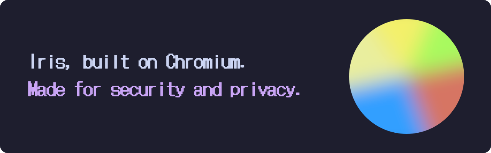

> [!NOTE]
> **Work in progress.** Iris is not released yet; there are no downloads yet, and some features listed below are still being built.

<p align="center"></p>

Iris started with a look at the most hardened, privacy-focused browsers around. We took what worked, improved on it, and added what they were missing. It's a hardened browser for the modern age, and an open-source alternative if privacy & security matter to you.

## Download

| Platform | Package | Install | Notes |
|---|---|---|---|
| **Ubuntu / Debian** | [.deb · amd64](https://github.com/jegly/iris/releases/latest) | `sudo apt install ./iris-browser-stable_*_amd64.deb` | Includes the setuid sandbox helper and an AppArmor profile, so the full Chromium sandbox works without extra setup. |
| **Android** | [.apk · arm64](https://github.com/jegly/iris/releases/latest) | `adb install iris-*.apk` | Package `io.jegly.iris`. Allow installs from your browser or file manager when Android asks. Runs without Google Play Services; security-key sign-in (like a YubiKey) uses them if they're installed. |
| **Snap Store** | [snap · amd64](https://snapcraft.io/iris) | `sudo snap install iris` | Built from the same .deb, with the full browser sandbox and a minimal set of permissions. Camera and microphone stay disconnected until you connect them. Updates arrive through snapd. |

## What Iris technically changes

Iris starts from upstream Chromium source and applies small, documented patches plus a hardened build configuration. Red lines are removed or switched off; green lines are added or switched on by default. Everything applies to both Ubuntu and Android unless a line is tagged with one of them.

### Tracking & ads

```diff
+ Ad and tracker blocking on every site (EasyList + EasyPrivacy built in, with a per-site switch)
- Topics, Protected Audience and Shared Storage (Privacy Sandbox ad APIs)
- Third-party cookies
- <a ping>, sendBeacon() and fetchLater() (click and exit pings)
- Network Error Logging and the Reporting API (sites can't make your browser report back to them)
- HSTS on subresources (used as a supercookie)
- window.name carried from one site to the next
- Prefetch, prerender and preconnect of pages you haven't opened
- Text-fragment links, signed exchanges and compression dictionaries
- FedCM sign-in prompts
- Tracking parameters such as utm_, fbclid and gclid in links
+ Data stored by bounce-tracking sites deleted automatically (Chromium default, kept)
+ Global Privacy Control (Sec-GPC) sent to every site
+ Heavy ads unloaded automatically (Chromium default, kept)
```

### Fingerprinting

```diff
- navigator.userAgentData and every Sec-CH-UA header (sites can't request them either)
- Servers asking for extra device details during the connection handshake
- Battery status, gamepads, speech voices and speech recognition
- Keyboard layout, multi-screen details and navigator.connection
- Local font access, the eyedropper and the installed-apps list
- Origin trials (sites can't switch removed features back on)
+ A single Accept-Language value instead of your full list
+ Canvas, audio and WebGL fingerprints randomised per site and per session
+ CPU core count and device memory reported as common fixed values
- WebGL until you allow a site (off by default, one click to enable)
```

### Google services

```diff
- Google sign-in and sync, cross-device sign-in and shared tab groups
- Search suggestions sent as you type, and mistyped addresses sent to Google for suggestions
- Translate offers, spellcheck dictionary downloads and autofill server lookups
- Built-in AI: Prompt, Summarizer, Writer, Rewriter, Translator and language-detection APIs, the on-device model, AI checkout scanning and the AI settings page
- Safe Browsing surveys and file uploads for deep scanning
- Remote new tab page, search-engine logo, popular sites and Google's favicon server
- Cast device discovery, the Discover feed and Touch to Search
- Google sign-in widgets on other sites, until you allow them
- Background networking, field-trial experiments, usage statistics and crash reports
+ DuckDuckGo as the default search engine, and a new tab page that stays local
```

### Web APIs

```diff
- JavaScript JIT and WebAssembly for websites (can be allowed per site)
- WebRTC, WebGPU, WebXR and WebNN
- WebUSB, WebHID, Serial, Bluetooth, NFC and Direct Sockets
- File System Access pickers and wake lock
- Push messaging, background fetch, Web Share, contacts and WebOTP
- Presentation, remote playback, app badging and vibration
- Device posture, compute pressure, storage buckets and digital credentials
- Window-controls overlay, sub-apps, launch queue, managed configuration and protocol handlers
- Handwriting ink, raw media-stream processing and Animation Worklet
- Declarative partial page updates (experimental)
- The Payment Request API and its browser-side interface
```

### Your controls

```diff
+ App lock: a passphrase before the browser opens, and it locks again after a period away
+ Automatic data shredding you can switch on: cookies, site data and cache cleared on a schedule
+ Extension auto-updates off unless you switch them on
+ Forget a site: its cookies and data deleted when you close the browser
+ A JavaScript on/off switch, globally and per site
+ Per-site controls for JavaScript, cookies and images
+ A custom user agent for any site
+ Cookies, saved logins and bookmarks encrypted with your passphrase
+ Catppuccin Mocha theme and dark mode by default, with 100+ themes to choose from and an optional glass look
```

### Network & TLS

```diff
+ TLS 1.3 minimum, with Encrypted Client Hello and post-quantum key exchange
+ Encrypted DNS in secure mode: Quad9 by default, 15 resolvers to choose from
+ HTTPS-Only mode: a warning before any http:// page
+ Full URLs in the address bar, www. and m. included
+ Websites can't reach your router, printer or localhost (Chromium default, kept)
+ Cache, connections and storage partitioned per site (Chromium default, kept)
+ Cookies and saved logins encrypted with a key from your desktop keyring, including in the snap [Ubuntu]
+ Lookalike-domain (IDN homograph) warnings (Chromium default, kept)
```

### Memory safety & compiler

```diff
+ Control-flow integrity (CFI, including indirect calls) with a ThinLTO release build
+ Strong stack protector, stack-clash protection and zero-initialised stack variables
+ Shadow call stack, plus pointer authentication and branch target checks (PAC/BTI) [Android]
+ Hardened C++ library with bounds checks, and _FORTIFY_SOURCE (level 3 [Ubuntu])
+ Array-bounds traps and defined integer overflow (Chromium default, kept)
+ Full RELRO, non-executable stack and position-independent executables
+ PartitionAlloc hardening in every process; internal safety checks kept on in release
+ Memory-safe Rust decoders for JPEG, ICO and BMP images
- Hardware video decode, SwiftShader, remote desktop, VR/AR, Widevine DRM and the on-device AI model, all left out of the build
- Printing and local-network device discovery
- Background mode, Family Link, page previews, on-device speech and translation services, media remoting, the Bluetooth and printing system libraries and the AV1 encoder, left out of the build
```

### Process isolation

```diff
+ Strict site isolation on desktop and Android: every site in its own process
+ Origin-keyed processes and strict origin isolation, so subdomains are separated too
+ Error pages and sandboxed iframes in isolated processes
+ V8 heap sandbox; web renderers run JIT-less with a tighter sandbox
+ The network service, which handles everything from the internet, sandboxed too [Ubuntu]
+ Other programs running as you can't read the browser's memory [Ubuntu]
+ Setuid sandbox helper and AppArmor profile in the .deb, so the full sandbox works without user namespaces [Ubuntu]
```

### Defaults & permissions

```diff
+ Camera, microphone, location, notifications and clipboard blocked until you allow a site
+ Web MIDI, idle detection, motion and light sensors and background sync blocked until you allow a site
+ Permission prompts only after a click; unused site permissions revoked automatically
+ Popups only from real clicks; downloads never open by themselves
+ PDFs open in your system viewer instead of inside the browser
+ Media licence requests over HTTPS only, with size limits
- Admin and MDM policies: nothing outside the browser can reconfigure it
- Kerberos and enterprise management features, left out of the build
- Offers to save passwords, addresses and cards (use a dedicated password manager)
- First-run welcome and import prompts [Ubuntu]
```

### Android only

```diff
+ Location from Android itself, without Google Play Services
+ Every protection built into the app itself, because Android ignores launch flags
+ Installs alongside Chrome as its own app (io.jegly.iris)
- Trust in user-installed CA certificates (blocks TLS interception)
- Android and Google cloud backups of browser data
- The first-run setup flow and DRM preprovisioning at startup
```

## What you give up

Hardening has a cost. These are the ones you are most likely to notice.

- **Browser video calls.** WebRTC is off, so Meet, Zoom and Discord calls in the browser won't work. Use their desktop or mobile apps.
- **Heavy web apps.** Without JIT, WebAssembly and WebGL, some apps (maps, design tools, games, in-browser editors) are slower or need to be allowed per site.
- **Streaming DRM video.** Widevine isn't included, so Netflix, Disney+ and Spotify's web player won't play protected content.
- **Old sites and Wi-Fi sign-in pages.** Sites that only support TLS 1.2 or plain HTTP show a warning or won't connect. Encrypted DNS never falls back to plain DNS, so some hotel and airport Wi-Fi sign-in pages won't load until you switch secure DNS off.
- **Printing.** Printing is switched off, including "Save as PDF". To keep a copy of a page, save it or take a screenshot.
- **Autofill, saved passwords and payment sheets.** Iris doesn't offer to save addresses, cards or passwords, and sites can't open the browser's payment sheet, so checkouts use their normal card form. A dedicated password manager is the better place for logins.
- **Extension updates.** Extensions work, but they don't update themselves unless you switch that on. Update checks go to the Chrome Web Store, which sees which extensions you have.
- **Company-managed setups.** Iris ignores admin and MDM policies and has no Kerberos sign-in, so workplaces can't manage it centrally.

## Verify your download

Each release carries `SHA256SUMS`, `SHA256SUMS.asc` (signed by jegly) and jegly's public key.

```bash
gpg --import jegly.asc
gpg --verify SHA256SUMS.asc SHA256SUMS
sha256sum -c SHA256SUMS --ignore-missing
```

Check the signature first, then the checksum. `packaging/verify/iris-verify.sh <file>` does both steps.
This proves the file is the one jegly published; it is not a reproducible-build guarantee.

## Building from source

Iris is a set of small, guarded patch scripts applied to an upstream Chromium checkout, plus build configs.

1. Get Chromium (`depot_tools`, `fetch chromium`) and check out the base commit in
   `patches/snapshot/*.base-commit` (currently `90b94f20cbf6d512624a5ab4ef5920311d50c7ec`).
2. Build the ad-block ruleset: `adblock/build-ruleset.sh` (downloads EasyList + EasyPrivacy, needs the
   `ruleset_converter` tool from `out/Default`).
3. Apply everything: `patches/apply-all.sh ~/path/to/chromium/src`. Each script checks the code it changes and
   stops with an error if upstream has drifted; re-running is safe.
4. Configure and build:
   ```bash
   cp build/args-linux.gn out/Linux/args.gn && gn gen out/Linux
   autoninja -C out/Linux chrome chrome/installer/linux:stable_deb
   ```
   Android: `build/args-android.gn` and `autoninja -C out/Android chrome_public_apk`.

`build/args-dev.gn` is a faster non-official config for development. After building, open
`test/iris-selftest.html` from a local server to check the removed APIs, permissions, ad blocking and headers.

## Repository layout

| Path | Contents |
|---|---|
| `patches/` | one script per change; `apply-all.sh` runs them in order |
| `build/` | gn args for Linux, Android and dev builds |
| `adblock/` | ruleset builder; bundled lists and their license |
| `packaging/` | .deb notes, snap, launcher, release verification tools |
| `branding/` | icons, orb logo, theme palettes |
| `website/` | the project website (`index.html`); `build-readme.py` turns it into this README, `make-banner.py` draws the banner |
| `test/` | self-test page for a built browser |
| `FEATURES.md` | every feature and the patch behind it |

## Reporting problems

Bugs: [GitHub issues](https://github.com/jegly/iris/issues). Security issues: please report privately through
GitHub's *Report a vulnerability* (Security tab) rather than a public issue.

## Credits and licenses

- Chromium: BSD-3-Clause and the licenses of its third-party components (see `chrome://credits` in the browser).
- EasyList and EasyPrivacy filter lists: The EasyList authors, GPLv3+ / CC BY-SA 3.0
  (shipped as `/usr/share/doc/iris-browser-stable/filter-lists-LICENSE`).
- DotGothic16 font (Iris wordmark): The DotGothic16 Project Authors, SIL Open Font License 1.1 (`website/fonts/OFL.txt`).
- Catppuccin colour palette: the Catppuccin project, MIT.
- Iris patches and tooling: GPL-2.0-or-later (`LICENSE`). "Or later" because Chromium contains Apache-2.0
  components, which are compatible with GPL-3.0 but not GPL-2.0-only.

Iris is made by [jegly](https://github.com/jegly). It is based on Chromium and not affiliated with Google.
